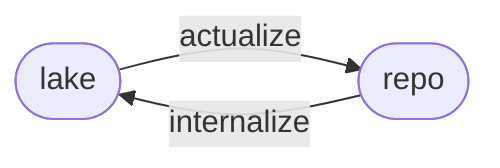

Sirno works through two *forms*: `lake` and `repo`.

`lake` is the configured Sirno Lake.
It is the canonical design source for a Sirno-managed project.
It contains compact Markdown *entries* with exact metadata,
and may contain lake-owned *entry artifacts* attached to those *entries*.

Anchor records the accepted baseline for the *lake*.
Git versions the *lake* and Anchor file together.

`repo` is the *repository*.
It contains source, tests, configuration, generated files, assets, README files,
design documents outside the *lake*,
and any other material that can actualize or witness design.
Sirno scans *repository witnesses* only when `[repo].members` is configured.

The *forms* are not just storage locations.
They are roles in a design workflow.
The *lake* is optimized for canonical addressability,
so a person or tool can find the named design object that matters to a local change.
The *repository* is optimized for use,
so design commitments can become code, tests, generated output, narrative documents,
or other inspectable material.

Once the *lake* exists,
it carries design authority.
Repository material can challenge, inform, or witness the *lake*,
but durable design knowledge belongs back in the *lake*.
This keeps README files, design documents, source comments, tests, and generated outputs useful
without making any of them a competing source of truth.

The two forms define one polarity.
`actualize` moves from `lake` to `repo`.
`internalize` moves from `repo` to `lake`.
All other repository artifacts are materials that can be explored,
discarded, regenerated, or revised from a well-maintained *lake*.

