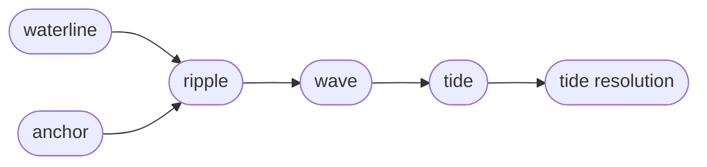

Sirno Tide is the dependency-review subsystem of an anchored lake.
It is the front door for how Sirno turns lake edits into review obligations.
It is a local refinement of *versioning*,
parallel to Anchor.

The subsystem rests on one comparison.
The *waterline* is the current lake.
Anchor is the accepted baseline.
Every *entry* that differs between them is a *ripple*.

The subsystem turns that comparison into work.
Each *ripple* produces a *wave* of *tide workitems*
through the structural relation entries' tide policies.
The *tide* is the union of all open obligations across every *wave*.

The subsystem stays honest through scoped acceptance.
A *tide resolution* records one reviewed obligation
bound to a *ripple fingerprint*,
so a later change to the same *ripple* reopens it.
*Infer resolution* closes obligations whose *neighbor* also changed in the same edit.
A clear *tide* gates `sirno anchor update` after the first Anchor is initialized.

These entries form one review neighborhood.
Read them together when changing how edits become review obligations.
