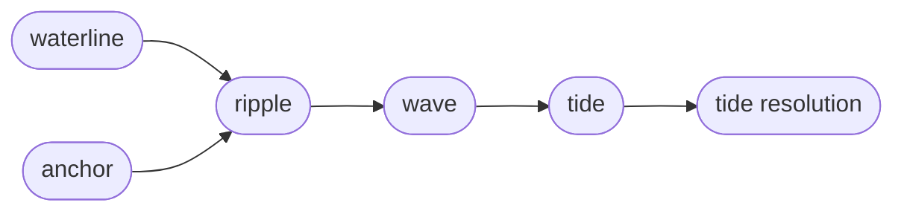

Tide is the dependency-review subsystem of an anchored *lake*.
It turns *lake* edits into review obligations by comparing the *waterline*,
the current *lake*, against Anchor, the accepted baseline.
It is a local refinement of *versioning*,
parallel to Anchor.

Every changed *entry* is a *ripple*.
Each *ripple* produces one *wave* of *tide workitems*
through the structural relation entries' tide policies.
The *tide* is the union of all open obligations across every *wave*.

Tide keeps review acceptance scoped to the exact delta a reviewer saw.
A *tide resolution* records one reviewed obligation
bound to a *ripple fingerprint*,
so a later change to the same *ripple* reopens it.
*Infer resolution* closes obligations whose *neighbor* also changed in the same edit.
A clear *tide* gates `sirno anchor update` after the first Anchor is initialized.

Sirno derives open *workitems* on demand.
It stores no worklist;
the current implementation keeps only *tide resolutions* in `.sirno/tide.toml`,
each scoped to a *ripple fingerprint*.
That binding is what reopens an obligation when its *ripple* changes again.
The Tide review file is deleted after Anchor accepts the waterline.

## Related Design Entries

Tide is the subsystem boundary.
These related entries are the review route through the local mechanics:

- *Ripple* defines entry-level lake deltas and ripple fingerprints.
- *Tide Workitem* defines the review obligation tuple.
- *Tide Resolution* defines persisted review records and reopen behavior.
- *Tide Review File* defines `.sirno/tide.toml`.
- *Tide Commands* defines CLI and MCP command spelling and behavior.

The *repository witnesses* for this entry should show command dispatch
and workitem derivation from structural relation policy.
