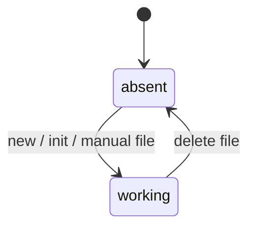
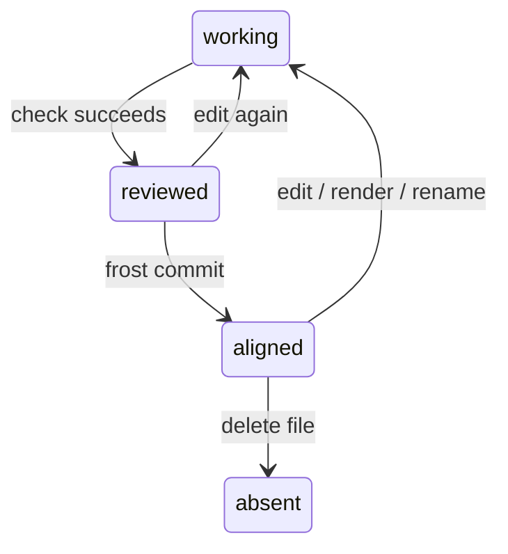
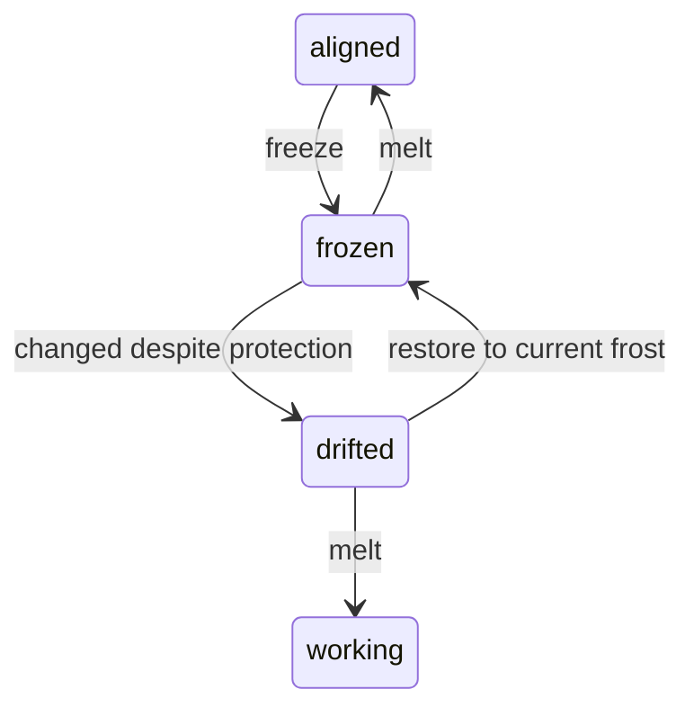
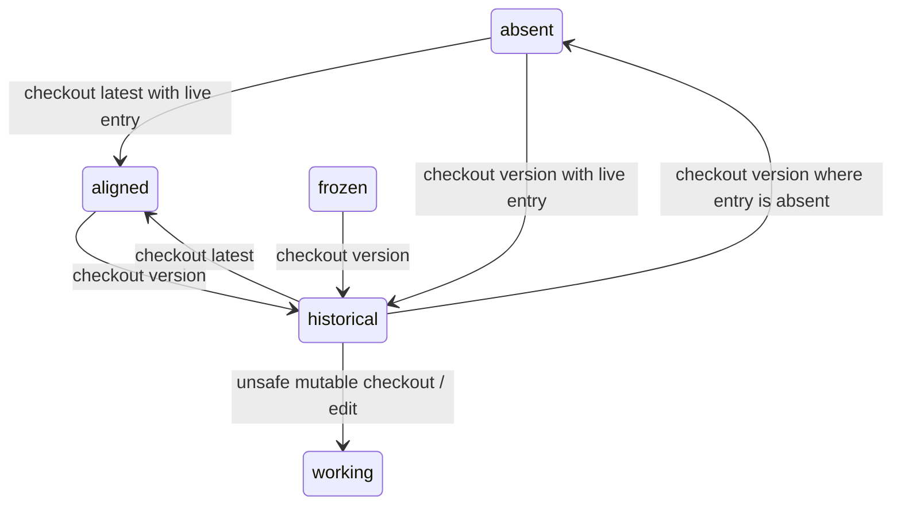

## Model

An *entry lifecycle* describes how one lake Markdown *entry* moves through the lake.
The lake file is the working form.
The frost layer is the committed reference line when frost is configured.
The state definitions use *waterline* for the current lake
and *frostline* for the latest frost snapshot.

The lifecycle has stored states and check gates.
Stored states are visible from files, frost snapshots, and the lock file.
Check gates are predicates that commands require before they continue.
`sirno check`, `sirno query`, `sirno rg`, `sirno witness`, and `sirno status`
observe entries without changing their lifecycle state.

## Transition Maps

The maps below separate transition families so each diagram stays readable.
Each node is a lifecycle state.
Each edge is a command or event that moves one entry between states.

### Creation And Editing

Creation and ordinary editing are lake operations.
They create or change the working file before frost is involved.
Edits, render operations, and renames keep an entry in the working state,
so they are explained below rather than drawn as state changes.

### Review And Commit

Review and commit move a valid working file set into the aligned state.
The reviewed state is a command gate,
not a flag stored on the entry file.
A failed check or no-op commit leaves the entry in its existing state,
so those cases are described in prose.

### Freeze Protection

Freeze protects one aligned entry from drift.
It does not create a frost snapshot.
A failed commit from the drifted state leaves the entry drifted.

### Checkout And History

Checkout materializes frost snapshots back into the lake.
Latest checkout returns to the aligned state.
Explicit version checkout creates a historical lake file.

### Non-Transition Commands

Observer and frame commands do not move one entry file.
They report state,
update review bookkeeping,
or move configured storage paths.
Because they do not transition one entry between lifecycle states,
they are not drawn as lifecycle transitions.

## State Definitions

`absent` means no managed Markdown file exists for the *entry address* in the waterline.
`sirno new`, `sirno init`, `sirno lake init`, manual file creation,
or checkout of a live frost entry can create the file.
If an entry is absent from the waterline but live in the frostline,
`sirno commit` records a lifecycle deletion marker.

`working` means the waterline file exists and may differ from the frostline.
It is the normal editing state.
Direct Markdown edits, generated-link rendering,
metadata updates, and renames keep the file in working state.
A rename changes the *entry address*.
For frost, the old path and new path are different entries.

`reviewed` means the working file set passed the review checks required for commit.
It is a gate, not a stored state.
A later edit, stale generated footer,
bad structural reference,
bad witness reference,
parse error, or unsupported lake file can remove this gate.

`aligned` means the committed form of the waterline *entry* matches the frostline.
Generated-link regions are lake projections
and are removed before comparison with frost.
An aligned entry can still be writable.
Editing it moves it back to working state until the next successful frost commit.

`frozen` means the waterline file carries a `frozen:` reason.
For frost-backed manual freeze,
that reason is `reviewed` and the committed form matches the frostline.
`sirno freeze ENTRY_ADDRESS` enters this state.
The command verifies current frost first,
then adds `reviewed` and applies local file protection.
`sirno melt ENTRY_ADDRESS` removes `reviewed`,
clears local file protection when no other reason remains,
and returns the entry to the aligned state if the content still matches frost.
Crystallization can also enter this state by writing `managed`.

`drifted` means a frozen waterline entry no longer matches the frostline.
This is an error state.
It can happen if a read-only file is changed outside Sirno,
if a frozen entry is renamed,
or if metadata or prose is changed after bypassing file permissions.
`sirno commit` refuses this state.
The supported exits are to restore the entry to current frost
or to melt it before intentionally changing it.

`historical` means the lake file was materialized from an explicit frost version.
A normal version checkout is immutable:
Sirno writes a read-only blockquote
and applies local file protection to the *lake* root,
managed entry files,
and managed artifact trees.
`sirno checkout --latest` returns to the mutable current lake.
`sirno checkout VERSION --unsafe-mutable` deliberately turns a historical version
into a writable working baseline.

## Projections And Frame Commands

`sirno render` changes only Sirno-owned generated footer regions.
Those regions help readers navigate,
but they are removed before frost commits.
Authored prose and metadata are the committed entry content.

`sirno query`, `sirno rg`, `sirno witness`, `sirno check`, and `sirno status`
do not move an entry between lifecycle states.
They read the lake,
report structure,
or inspect configured repository evidence.

Storage commands affect the frame around entries.
`sirno init` prompts for lake, frost path, and packaged skill wrapper setup.
`sirno init --all` creates those parts together without prompts.
`sirno lake move PATH` moves the lake path.
`sirno frost init` and `sirno frost move PATH` configure or move the frost path.
`sirno move lake PATH` and `sirno move frost PATH` select the same storage moves.
They do not change one entry file's lifecycle state by themselves.
`sirno move entry OLD_ENTRY_ADDRESS NEW_ENTRY_ADDRESS`
follows the same lifecycle behavior as `sirno entry move`.

---

> **Sirno generated links begin. Do not edit this section.**

- belongs (to):
  - [entry](entry.md)
- belongs (from): (none)

> **Sirno generated links end.**
