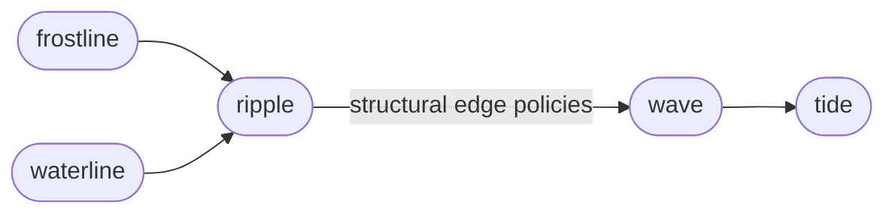

A *tide* is the dependency-based review worklist for the current lake.
It compares the *waterline*, the current lake,
against the *frostline*, the latest frost snapshot.

Every changed *entry* is a *ripple*.
For each *ripple*, Sirno reads the configured structural edge policies
and produces one *wave* of *tide workitems*.
The *tide* is the union of those open obligations.

Sirno derives open *workitems* on demand.
It stores no worklist;
`Sirno.lock.toml` keeps only *tide resolutions*,
each scoped to a *ripple fingerprint*.
That binding is what reopens an obligation when its *ripple* changes again.

`sirno tide status` reports the open worklist.
It prints one table grouped by the *entry* that needs review.
The reason column lists the *ripple* entries whose changes created the obligations.
Group boundaries use heavy double separators,
and a one-sentence summary follows the table.
`sirno tide status --by wave` groups output by *wave* instead.
`sirno tide status --show full` prints full open *workitem* statuses
in the same grouped table,
and `--show all` includes resolved statuses.

Resolving, reopening, and resetting the worklist,
the *frost* commit gate,
and the inference shortcut are *tide resolution* behavior.
