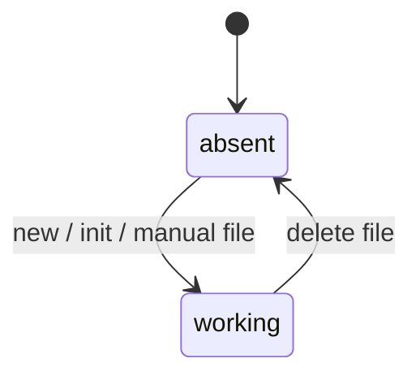
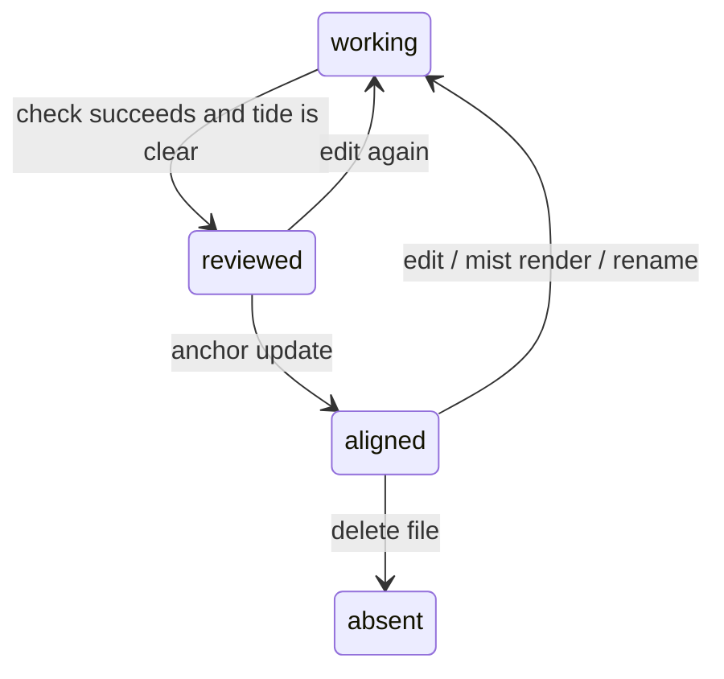
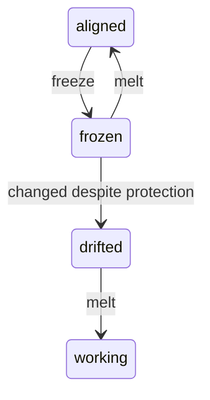

An *entry lifecycle* describes how one lake Markdown *entry* moves through the editable lake.
The waterline is the current lake.
Anchor is the accepted baseline used for comparison.

The lifecycle has stored states and check gates.
Stored states are visible from files and metadata.
Check gates are predicates that commands require before they continue.
`sirno check`, `sirno query`, `sirno rg`, `sirno witness`, and `sirno status`
observe entries without changing their lifecycle state.

## Creation And Editing

Creation and ordinary editing are lake operations.
They create or change the working file before Anchor accepts the result.

## Review And Anchor

Review and Anchor update move a valid working file set into the aligned state.
The reviewed state is a command gate,
not a flag stored on the entry file.

## Freeze Protection

Freeze protects one entry from local edits.
It does not create an Anchor baseline.

## State Definitions

`absent` means no managed Markdown file exists for the *entry address* in the waterline.
`sirno new`, `sirno init`, `sirno lake init`, or manual file creation can create the file.

`working` means the waterline file exists and may differ from Anchor.
It is the normal editing state.
Direct Markdown edits, generated-link rendering, metadata updates, and renames keep the file
in working state.
A rename changes the *entry address*.
For Anchor, the old path and new path are different entry records.

`reviewed` means the working file set passed the checks and Tide review required by Anchor update.
It is a gate, not a stored state.
A later edit, stale generated footer, bad structural reference, bad witness reference, parse error,
or unsupported lake file can remove this gate.

`aligned` means the canonical waterline *entry* matches Anchor.
Generated-link regions are lake projections and are ignored by the Anchor fingerprint.
An aligned entry can still be writable.
Editing it moves it back to working state until the next successful Anchor update.

`frozen` means the waterline file carries a `meta.frozen` reason.
`sirno freeze ENTRY_ADDRESS` enters this state.
`sirno melt ENTRY_ADDRESS` removes the manual protection reason
and clears local file protection when no other reason remains.
Crystallization can also enter this state by writing `managed`.

`drifted` means a frozen waterline entry changed despite local protection.
This is an error state.
It can happen if a read-only file is changed outside Sirno,
if a frozen entry is renamed,
or if metadata or prose is changed after bypassing file permissions.
The supported exit is to melt the entry before intentionally changing it.

## Projections And Frame Commands

`sirno mist render` changes only Sirno-owned generated footer regions in a misty lake.
`sirno render` is shorthand for the default or active mist render.
Those regions help readers navigate,
but they are ignored by Anchor fingerprints.
Authored prose and metadata are the accepted entry content.

`sirno query`, `sirno rg`, `sirno witness`, `sirno check`, and `sirno status`
do not move an entry between lifecycle states.
They read the lake, report structure, or inspect configured repository evidence.

Storage commands affect the frame around entries.
`sirno init` prompts for lake and packaged skill wrapper setup.
`sirno init --all` creates those parts together without prompts.
`sirno lake move PATH` moves the lake path.
They do not change one entry file's lifecycle state by themselves.
`sirno move entry OLD_ENTRY_ADDRESS NEW_ENTRY_ADDRESS`
follows the same lifecycle behavior as `sirno entry move`.

---

> **Sirno generated links begin. Do not edit this section.**

- belongs (to):
  - [entry](entry.md)
- belongs (from): (none)

> **Sirno generated links end.**
