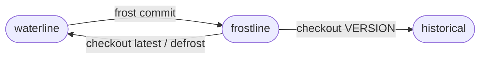

The *frost* path is optional private `eter` storage for immutable *lake* snapshots.
The default convention is `sirno-frost`.
`[frost].path` in `Sirno.toml` names the path,
and the path must stay separate from the lake.
The lake remains the editable working form.
The *frost* layer is the durable snapshot substrate behind that form.

This *entry* is also the review front door for the freezing subsystem.
`versioning` states the lake-wide snapshot model,
`sirno-lock` records the lake's frost state,
`entry-artifact` defines lake-owned bytes versioned with their owner,
`entry-freeze` protects one current frost-backed lake *entry* from edits,
`tide` is the frost-based review worklist,
`wave` is the workitem set produced by one *ripple*,
and `structural-edge-policy` splits structural rendering from relation-defined tide behavior.
A change to the snapshot path, the lock file, artifacts, *entry* protection, or the review worklist
usually constrains the others, so these parts are reviewed together here.

## Path And Storage

The `SirnoFrost` facade opens the configured filesystem backend
and exposes frozen data as ordinary typed Sirno *entries* and *entry artifacts*.
Each *entry* is stored under its dot-joined entry address.
The backend records `name`, `desc`, Sirno-managed `meta`, ordered structural metadata,
an artifact manifest,
and Markdown body as typed fields.
The stored `meta` field includes `meta.type`,
so intrinsic-field and structural-relation markers survive frost round trips.
Nested lake folders and lakelets are stored by their flattened entry addresses.
For example, `lake/core/design.md` is stored as `core.design`.
An *entry*'s presence is represented through the `eter` lifecycle field.
This keeps versioning in the storage layer
while preserving the lake *entry* schema.
Structural link relation order stays in Sirno's typed structural metadata,
so a frost round trip renders the same order back to Markdown.
The artifact manifest stores owner-relative paths for one *entry* version.
Changed artifact bytes are stored beside the entry's Markdown snapshot
in a matching version directory.
For the filesystem backend,
that directory uses the same version prefix and entry address as the Markdown row.
Unchanged artifact bytes are read from older matching version directories.

`sirno frost init [PATH]` configures frost when needed
and records the empty snapshot as version `0`.
It does not immediately import or commit the lake.
`sirno frost move PATH` renames the configured *frost* path
and writes the new path back to `[frost].path`.
`sirno frost mv PATH` is its short form.
`sirno move frost PATH` and `sirno mv frost PATH` select the same path move.
The move creates missing destination parents and refuses to replace an existing destination.
When `PATH` is inside the current *frost* path,
Sirno stages the directory through a temporary sibling
and recreates the parent path before placing the moved *frost* path at `PATH`.
`sirno frost gc` asks `eter` to collect rows unreachable from the latest frost snapshot
and removes artifact byte files unreachable from that snapshot.
It supplies that latest snapshot as the explicit live set
and writes the resulting GC generation to `Sirno.lock.toml`.
It preserves the kept snapshot's CLI-visible version coordinate.
The GC generation is the collision boundary for stale snapshot references.
Inherited artifact bytes remain in older version directories
when the latest artifact manifest still needs them.
It runs only while the lake is the current mutable frostline.

## Commit

A *frost* commit imports the selected lake *entry* set and its lake-owned artifacts.
The lake directory must pass review-mode checks before any snapshot is written.
The active *tide* must also be clear before any snapshot is written.
Entries carrying the `reviewed` frozen reason are protected lake files
that must still match the current frost snapshot with their artifact trees.
The frost layer accepts unchanged reviewed entries and artifacts,
and refuses a frozen entry bundle that differs from that snapshot.
The reviewed comparison ignores only the `reviewed` reason itself,
so freeze can mark an unchanged entry without making the entry appear changed.
Other frozen reasons stay part of the committed entry.
Sirno strips generated-link regions from committed bodies,
because *generated footers* are lake projections.
Frost stores frozen reasons with the entry.
Commit and checkout preserve whether an entry is frozen
and preserve every reason recorded in `meta.frozen`.
The commit writes one `eter` transaction and returns a `SnapshotRef`.
The transaction contains changed *entries*,
entries whose artifact manifests changed,
and lifecycle deletion markers.
Only changed artifact bytes receive files in the new version directory.
Unchanged live *entries* are inherited from earlier version files at read time.
Unchanged artifact bytes are inherited from earlier version directories.
That snapshot reference names the whole committed *lake* state.
For the filesystem backend,
`Eter.lock.toml` stores the committed version boundary.
Version files above that boundary are ignored
and removed before the next write.
If the lake is unchanged,
the commit returns the current snapshot reference without writing.
If a previously live *entry* is missing from the lake,
the commit records an `eter` lifecycle deletion marker.
`sirno commit` runs this import.
`sirno frost commit` is the grouped form.
`sirno commit --unsafe-resolve-all` bypasses the *tide* gate for that commit
without writing fake resolutions.

## Read And Checkout

The *frost* read path reconstructs *entries* and artifacts from a selected snapshot.
It can read one *entry*,
all live *entries* at the current snapshot,
or all live *entries* at a specific `SnapshotRef`.
A CLI version coordinate is paired with the current `eter` GC generation
before the snapshot is read.
After `sirno frost gc`,
older snapshot references from the previous GC generation are stale.
Artifact bytes no longer reachable from the kept snapshot are removed.

Checkout materializes one frozen snapshot as Markdown files and `.artifacts` files.
It writes the frozen reasons stored in that snapshot back to entry metadata.
The conservative write policy writes only into an absent or empty target directory.
CLI checkout replaces managed Markdown files in the configured lake
and preserves ignored paths.
`sirno checkout --latest` materializes the current snapshot as a mutable current *lake*.
`sirno defrost` is shorthand for `sirno checkout --latest`.
The grouped shortcut is `sirno frost defrost`.
The grouped checkout command is `sirno frost checkout`.
Explicit version checkout writes a visible read-only blockquote
and applies local file protection to the *lake* root,
managed *entry* files,
and checked-out artifact trees.
`--unsafe-mutable` leaves an explicit version checkout writable.

## Lock State

`Sirno.lock.toml` records the lake state relative to *frost*
and may also record upstream crystallization state.
`status = "current"` means the lake is the editable current version.
`status = "checked-out"` means the lake materializes a selected frozen version.
The lock stores the snapshot generation and version,
plus `mutable = true` only for unsafe mutable checkouts.
Sirno refuses to commit an immutable checkout.
Committing a mutable checkout creates a new current snapshot.

The frost path is private substrate.
Users and tools may inspect it when debugging storage,
but normal Sirno work should read and edit the lake
or use version-aware Sirno interfaces.
The *witness* regions for this *entry* show the facade,
snapshot reads,
commit path,
checkout path,
seed initialization,
artifact storage,
and deletion handling in `src/frost.rs`.

---

> **Sirno generated links begin. Do not edit this section.**

- belongs (to): (none)
- belongs (from):
  - [entry-artifact](entry-artifact.md)
  - [entry-freeze](entry-freeze.md)
  - [sirno-lock](sirno-lock.md)
  - [sirno-tide](sirno-tide.md)
  - [versioning](versioning.md)

> **Sirno generated links end.**
