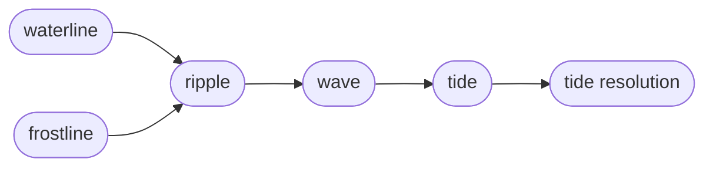

Sirno Tide is the dependency-review subsystem of a frost-versioned lake.
It is the front door for how Sirno turns lake edits into review obligations.
It is a local refinement of *versioning*,
parallel to *frost* and *Sirno Lock*.

The subsystem rests on one comparison.
The *waterline* is the current lake.
The *frostline* is the latest frost snapshot.
Every *entry* that differs between them is a *ripple*.

The subsystem turns that comparison into work.
Each *ripple* produces a *wave* of *tide workitems*
through the configured relation entries' tide policies.
The *tide* is the union of all open obligations across every *wave*.

The subsystem stays honest through scoped acceptance.
A *tide resolution* records one reviewed obligation
bound to a *ripple fingerprint*,
so a later change to the same *ripple* reopens it.
*Infer resolution* closes obligations whose *neighbor* also changed in the same edit.
A clear *tide* gates the next frost commit.

These entries form one review neighborhood.
Read them together when changing how edits become review obligations.

---

> **Sirno generated links begin. Do not edit this section.**

- belongs (to):
  - [sirno-frost](sirno-frost.md)
  - [sirno-lake](sirno-lake.md)
- belongs (from):
  - [ripple](ripple.md)
  - [tide](tide.md)
  - [wave](wave.md)

> **Sirno generated links end.**
